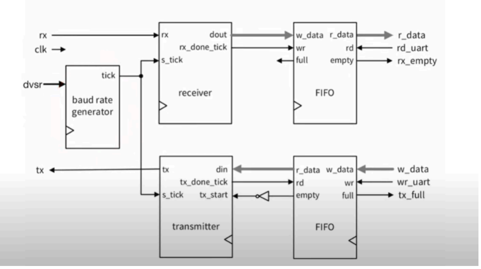
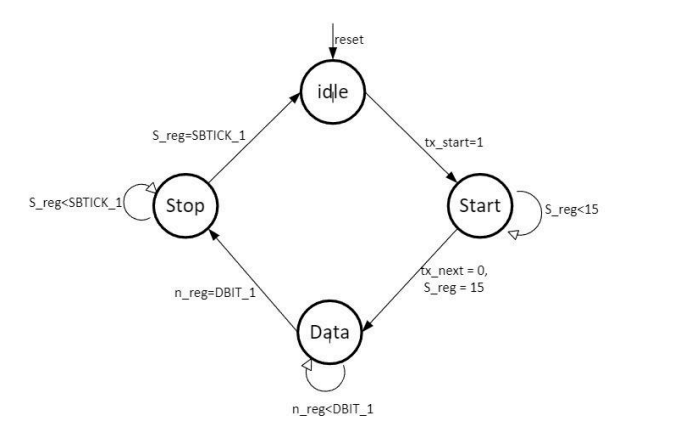
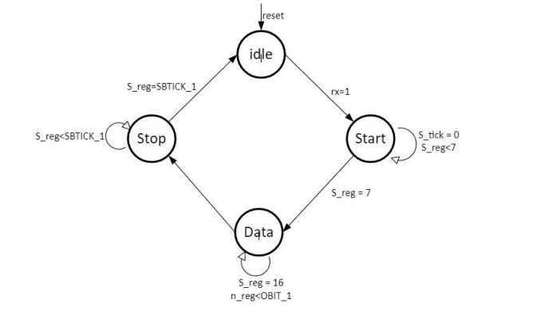
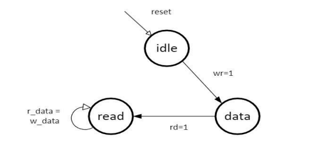
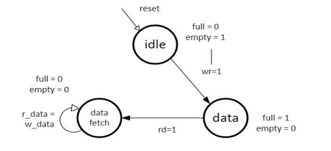
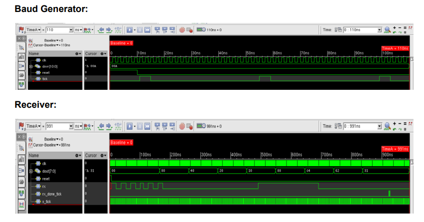
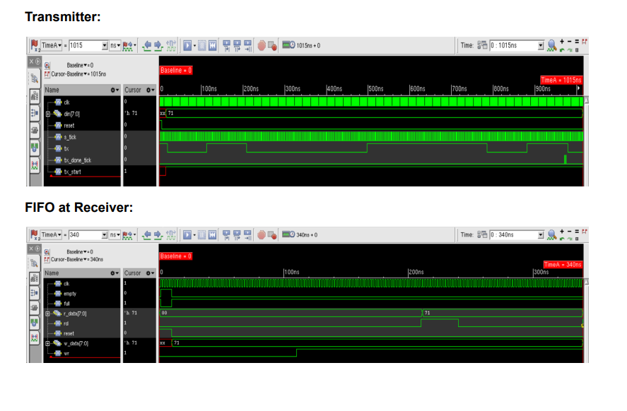
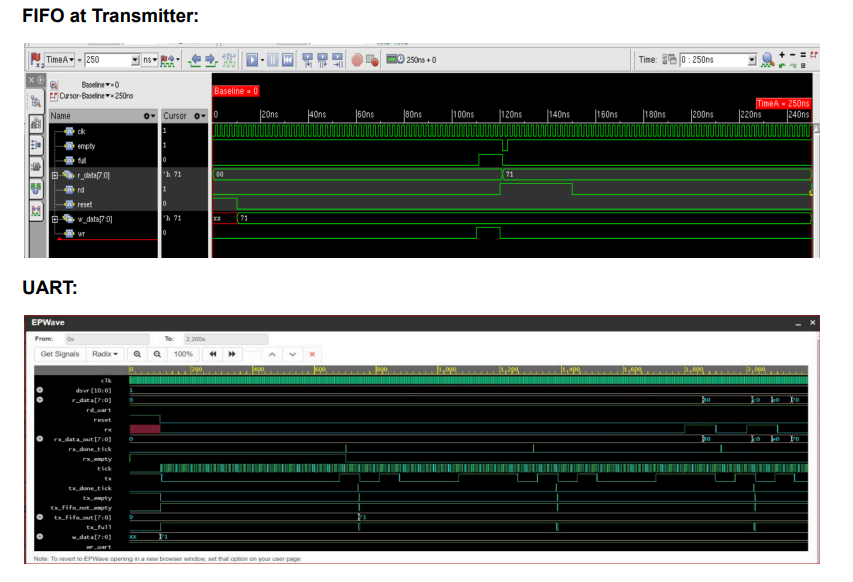

# Digital Design, Design Verification, and Physical Design of an Industry Standard UART

This project presents the design, verification, and synthesis of an industry-standard UART (Universal Asynchronous Receiver Transmitter) module. The focus is on digital design principles, functional verification, and physical implementation using Verilog.

# Code

You can find the verilog code & Testbench for each module. The code is organized and documented to facilitate easy understanding

## Block Diagram

## State Diagrams

You can find the verilog code & Testbench for each module. The code is organized and documented to facilitate easy understanding

## Results

